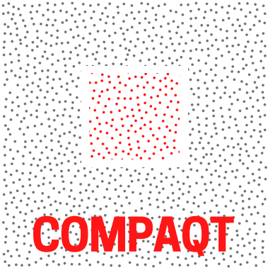
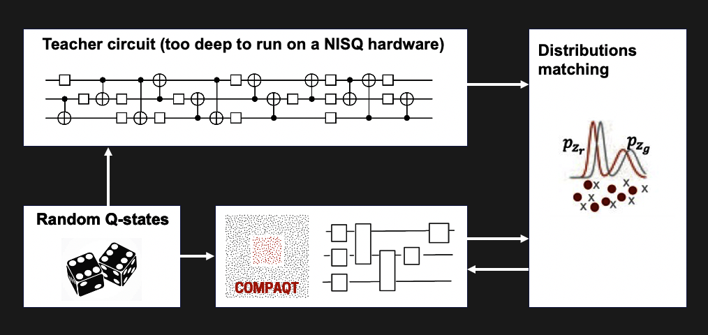
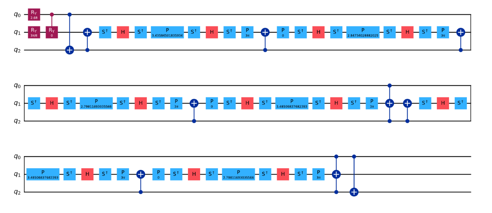
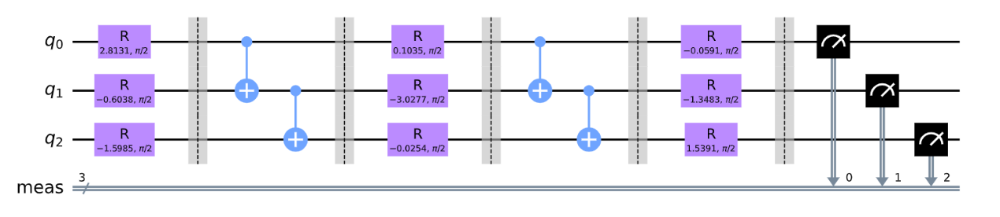
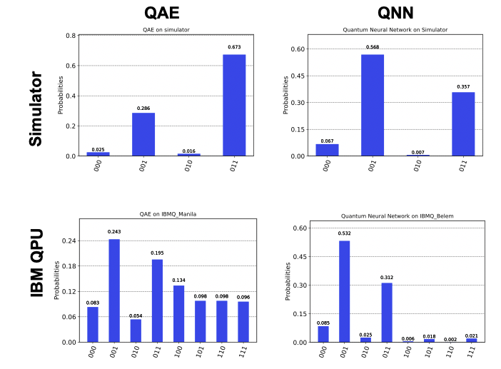

<p align="center">
    
</p>

Team: Mykola Maksymenko, Richard Givhan, Sourav Sen Choudhury, Jackson Wu

## Project description 

[Check presentation slides here](compaqt_presentation.pdf)

 Financial institutions, like JPMorgan Chase and HSBC, have been some of the most aggressive adopters of quantum technology to date. It's not hard to see why.
 
 With $90T+ AUM globally, the inefficiencies (2-3%) of classical approaches to portfolio optimization lead to annual costs of **$1.8T+**. Quantum algorithms can [outperform](https://arxiv.org/abs/2012.03819) their classical counterparts to reduce these costs by orders of magnitude-- theoretically. Quantum hardware constraints render these approaches infeasible for the forseeable future. Xanadu estimates that, for a quantum system to perform derivatives pricing on an industry-scale problem, it would need 7.5k qubits, it would need to be 100x faster than today's systems and, worst of all, it would need **46 Million gates**. Of these gates, most originate from the application of **Quantum Amplitude Estimation (QAE)**. At **Compaqt**, we figured that if we could replace QAE with a more efficient circuit, then we could reach our financially efficient future, sooner.

Compaqt is building QNNs with considerably shorter gate sequences to replace circuitous algorithms like QAE. We do this via Quantum Knowledge Distillation and have so far achieved **10x size reduction** in gates.

## Technology approach

Knowledge Distillation is an elegant and surprisingly powerful concept originating from classical deep learning to compress large neural networks architectures. If you train a small **student** network to mimic output of a larger **teacher** network, it will asymptotically approach the performance of the teacher network. In other words, the student becomes the master!

<p align="center">
    
    
</p>


We apply this same concept to reduce the size of the Quantum Amplitude Estimation circuit. We feed the QAE circuit and a small 7-parameter QNN the same random input mapped to highly entangled quantum states, we then match the ouput distributions of the two networks, calculate the loss between the two and, using a Quantum Natural Gradient Optimizer, update the parameters of our student QNN. In this way, the student QNN progressively approximates the ouput of the unwieldy Quantum Amplitude Estimation (QAE) circuit. In fact, we managed to reduce the size of the QAE circuit by a **factor of 10**. 

From **this**: 

To **this**!


**CompaQt** QNN captures well the main features of the underlying distribution of large QAE circuit which can be well observed in the histograms below. While it clearly showcases the superior performance running on the QPU hardware. Here unlike the deep QAE circuit the two dominant peaks in the distribution well survive the effects of noise.  



## Business application

Please see [ our slides ](compaqt_presentation.pdf)  for a better understanding of our value proposition!

As mentioned up top, first-movers in quantum (JPMorgan Chase, HSBC, MUFG, etc.) swallow hundreds of billions (**$1.8T accross the industry**) in cost every year to the inefficiencies of classical financial optimization methods. We aim to reduce the size of the relevant quantum optimization approaches (Quantum Amplitude Estimation) to derivatives pricing so that these institutions may sooner adopt more efficient quantum methods. To do this, we will develop a model compression system that also reduces the number of logical qubits needed, as well as the number of gates.

We will initially tackle smaller-qubit (~100-200 qubit) optimization problems to gain industry traction, operating too within the chemical simulation industry, where there are useful problems at around 200 qubits, such as the simulation of penicillin (256).

## Qiskit Runtime usage description

Qiskit Runtime is a containerized execution environment that automates the process of setting up a quantum algorithm (circuit), running it multiple times (shots), and interpreting the results. Qiskit Runtime greatly simplifies this process by having the IBM quantum-classical hybrid cloud handle much of the work using its software architecture and containers, and according to IBM, this has created a 100x speedup in iterative circuit execution workloads.

There are currently two **primitives** implemented in Qiskit Runtime. Primitives are predefined programs that provide a simplified interface for defining near-term quantum-classical workloads. One is **Sampler**, which takes user circuits as an input and generates an error-mitigated readout of quasiprobabilities. This provides users a way to better evaluate shot results using error mitigation and enables them to more efficiently evaluate the possibility of multiple relevant data points in the context of destructive interference. The other is **Estimator**, which allows users to efficiently calculate and interpret expectation values of quantum operators required for many algorithms. In our project, we used Sampler.

To use Sampler, we have to first instantiate `QiskitRuntimeService`:
```
from qiskit_ibm_runtime import QiskitRuntimeService, Sampler

# Save credentials on disk for an IBM Quantum/Cloud account
# QiskitRuntimeService.save_account(channel="ibm_quantum", token="MY_IBM_QUANTUM_TOKEN")
# QiskitRuntimeService.save_account(channel="ibm_cloud", token="MY_IBM_CLOUD_API_KEY", instance="MY_IBM_CLOUD_CRN")
#
# Once account is saved on disk, service can be instantiated without any arguments
# service = QiskitRuntimeService()

# Enable an account just for the current session
service = QiskitRuntimeService(channel="ibm_quantum", token="MY_IBM_QUANTUM_TOKEN")

```
After we defined our `student_network` circuit
```
qc3 = QuantumCircuit(3)
qc=qc3.compose(student_network)
qc.assign_parameters(weights, inplace=True)
```
we called Sampler to run the job on the 5-qubit `ibmq_belem` chip, and we plotted the quasiprobabilities from the returned result:
```
with Sampler(circuits=qc, service=service, options={ "backend": "ibmq_belem" }) as sampler:
    # pass indices of circuits
    result = sampler(circuits=[0], shots=8192),
    print(result)
    
plot_histogram(result.quasi_dists)
```
The `circuits` argument above takes in a list of user-defined circuits. The list can be the order in which each circuit is defined (e.g. for the single circuit here, it is simply the index 0), or it can consist of names given to the defined circuits. Note that the `backend` option is required as we ran on IBM Quantum. However, if running on IBM Cloud, backend can be left unspecified, in which case the least busy backend is used.
    
