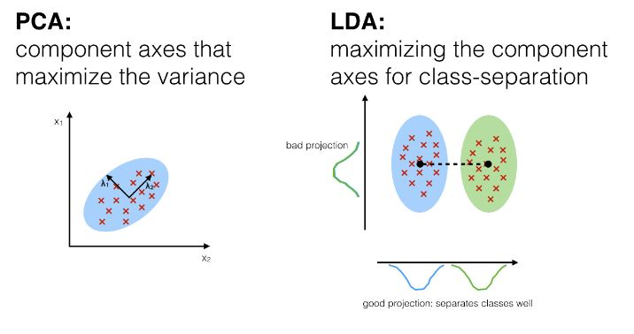
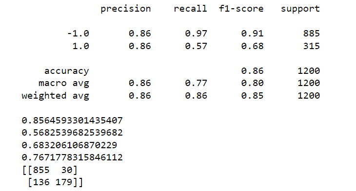
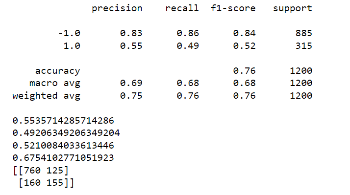
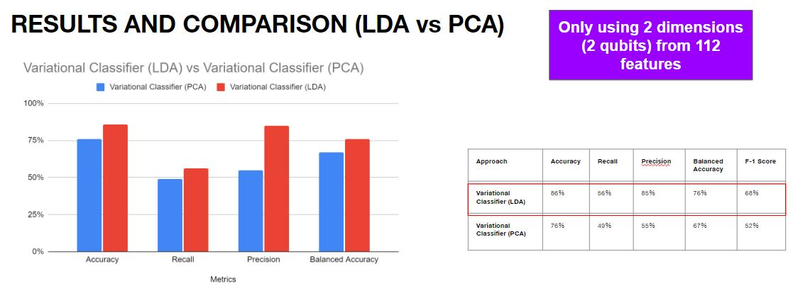
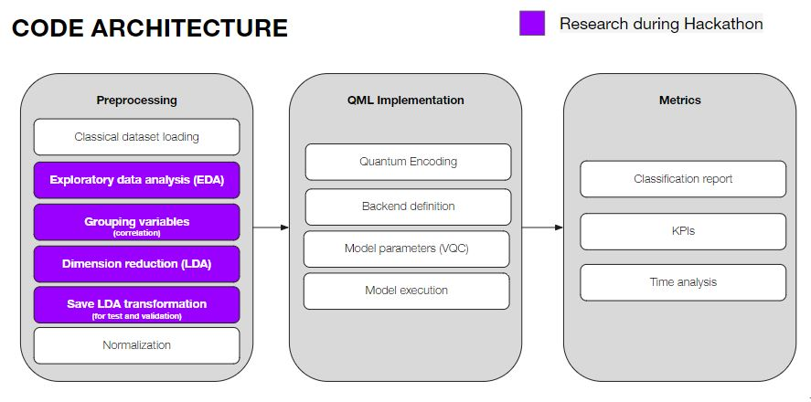

# Hackathon 2022: QML4FRAUD

This project is QML4FRAUD's submission for CDL Quantum Bootcamp Hackathon 2022, and will guide you through our implementation of using LDA to improve the encoding process of Variation Quantum Circuits in Quantum Machine Learning.

Team 9 Members: Yaqi Han, Jonas Tan, Mert Esencan, Javier Mancilla

## Our project: Novel approach about classical data preprocessing for classification problems using QML

Quantum Machine Learning (QML) involves the integration of quantum algorithms into machine learning techniques, and has the potential to be one of the more versatile uses of quantum computing, simply because of how far-reaching machine learning is. Furthermore, many QML techniques are robust and are touted to be able to be used in the NISQ-era. However, one of the main problems of implementing quantum algorithms into machine learning is the problem of encoding, which is basically how to encode classical data for hybrid quantum algorithms (in our case VQC). There has been many studies done with interesting results, but those usually have a small number of data pooints, and more importantly, a small number of features. This is due to the fact that current (and for the foreseeable NISQ-era) quantum computers and simulators have a small number of qubits that we can work with, and so encoding a large number of features into a small number of qubits might cause us to lose important information from the features.

Focusing on classification models, there have been several approaches discussed to solve this issue, and we believe that classical pre-processing is key to enabling QML to work for big datasets in the foreseeable future. Most current approaches for classification problems utilizes Principal Component Analysis (PCA) for the dimensionality reduction problem, but rather than getting component axes that maximize variance, it makes more sense to maximize axes for class separation for classification problems, hence we investigate Linear Discriminany Analysis (LDA) as a dimensionality reduction technique for the classical preprocessing.

## Investigation

### Data Set

We used a dataset from Kaggle related to fraud detection. The objective is to demonstrate the benefits of the preprocessing with LDA in conjunction with a variational classifier algorithm. This are the characteristics of the dataset:

- 20,000+ records.
- 112 features and a binary target variable.
- All numerical (perfect for the purpose of the hackathon and time constraints).

And it was taken from this link: https://www.kaggle.com/datasets/volodymyrgavrysh/fraud-detection-bank-dataset-20k-records-binary

For the purposes of our experiments and proof-of-concepts (as well as time constraints), we first cleaned the dataset as we noticed that there were some duplicated features and some features that did not deviate at all, then we sampled 4000 from the data set and did a 70:30 split for training and test set. All in all, we were left with:

- 4000 records
- 97 features and a binary target variable.

Note: To see how we perform the LDA and PCA, please look at [Solution via architecture.ipynb](./Solution%20via%20architecture.ipynb).

### Performing the LDA

Based on how many qubits we were planning to use, we needed to reduce the dimensionality of the features from 97 to N (supposing N was the number of qubits). For LDA, we needed to split the features into N groups. We did so via checking the correlations, and choosing the groups in such a way that features that were more strongly correlated with each other were in the same group, while features with less correlation where in separate groups. Beyond that, we then performed the dimensionlity reduction technique and proceeded to use the results in a simpled VQC tailored for binary classification. 

With 2 qubits (hence reduced to two dimensions), and 5 entangling layers, we achieved the following results:

### Performing the PCA

Since we stated at the outset that we were using LDA because it made more sense than PCA for encoding, we thought it prudent to show the results of performing PCA as a dimensionality reduction technique on the same dataset. Hence, we did the PCA on the data, and likewise used those results for encoding in a simpled VQC tailored for binary classification. 

With 2 qubits, and 5 entangling layers (same VQC structure as above), we achieved the following results:

## Results and Discussion

### Results

We can compare the results of the metrics in the graph below:

With these results, we can see that using LDA for encoding surpasses PCA for VQC preprocessing encoding. Furthermore, we also looked at other classical ML approaches (not in this repo) like Linear Regression, SVM, and KNN, and the LDA encoding for VQC binary classification technique is better. It however does worse than techniques like Decision Tree and Random Forest, but the results are extremely encouraging considering that we have only used 2 qubits for 2 dimensions.

### Future

We have shown a proof-of-concept that using LDA for encoding surpasses PCA for VQC encoding for classification purposes, or binary classification purposes at least. There are several more things that we hope to test in the future, for example, the most pressing items are:

- Extend this into multi-class classification techniques. This would be extremely useful and applicable to a wide range of problems
- Further experimentation with different types of encoding and VQC structures. We picked one and stuck with it, but we hope to improve on it by looking at others
- Academic studies. In this example, we have shown experimentally that LDA is superior, but an academic study into the mathematics and theory why would be enlightening.

This is our pipeline of what we did:

And we basically hope to experiment with every single part more.

## Business Application

Machine learning is ubiquitous in many of the best solutions to industrial problems. Quantum computing is proposed to enhance machine learning. We have used the case of fraud detection as a demonstration to show that using LDA as a preprocessing method with a variational classifier could enhance the QML model's performance and allow it to process a lot more features. And we believe that this could be further improved in the future. 

Since this is an improvement based on existing machine learning models, it has direct application in real cases. In principle, this could eventually be generalized for any multi-class classification problem. 

We are seeing that the finance sector is always within the top 3 industries related to quantum computing use cases and benefits. Example problems that our approach could be applied to include: 

- Credit scoring
- Fraud detection
- Default forecasting
- Churn prediction
- Loan approval

and many more. 

In other industries, improvement of classification also has many benefits. A quick but not complete list would include:

- Energy: energy loss detection.
- E-commerce: recommendation system.
- Several industries: forecasting.
- Healthcare: diagnosis.

## What is in this repository?

- [Solution via architecture.ipynb](./Solution%20via%20architecture.ipynb): This notebook contains the proof-of-concept and experiment for the LDA vs PCA, and basically runs through how we run the code.

- [Factory](./Factory): This folder contains two files: data.py and model.py. These two files are the basis for the unified architecture to prepare the data and run the VQC model for both LDA and PCA.
- [data.py](Factory/data.py): This file contains the class for preparing the data for both LDA and PCA within the same class PrepareData.
- [model.py](Factory/model.py): This file contains the class for using LDA and PCA to run the VQC.

