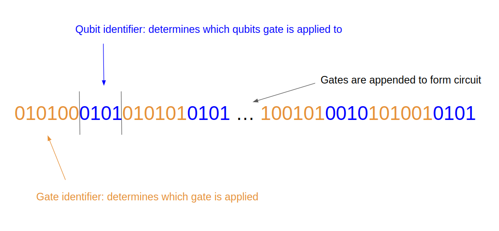
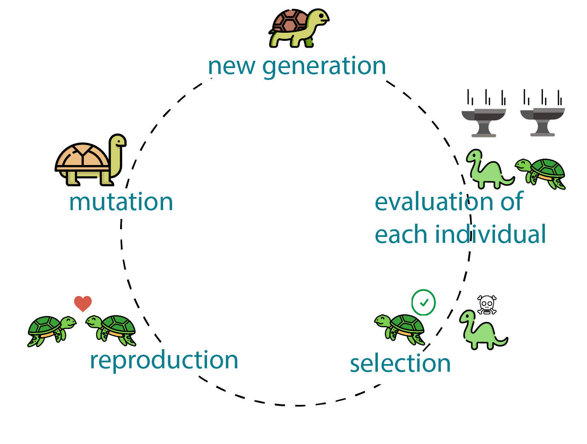
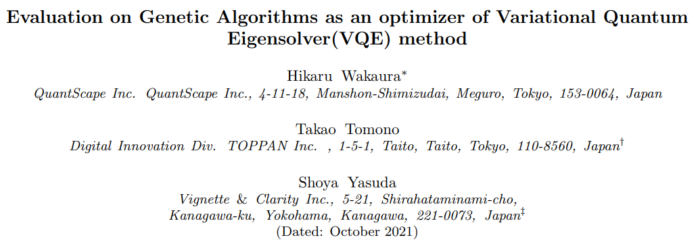
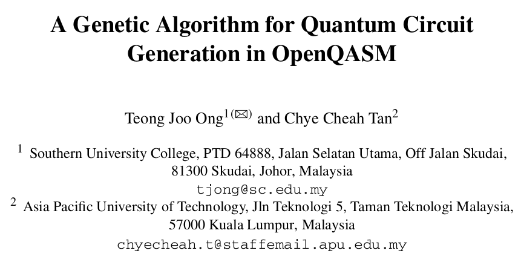

# Designing quantum circuits with genetic algorithms
In our project, we tackle the problem of computer generation of optimized quantum circuits by using genetic algorithms. The project consists of three main parts:
1. Designing a modular framework for leveraging the best properties of genetic algorithms to address the most important aspects of quantum circuit design.
2. Implementing this framework using Xanadu's package Pennylane, while making use of tools such as OpenQasm to ensure the usability of our solution across other platforms.
3. Analysing the business value of this solution in terms of technical performance, usability and overall impact on reducing the problem solving process for real-world applications.

## Quantum circuit design
Most quantum algorithms are formulated within the quantum circuit model. The power of the quantum circuit is three-fold:
1. The quantum circuit model is a universal model of quantum computation. This means that any conceivable quantum algorithm can, at least in principle, be expressed as a quantum circuit.
2. A quantum circuit specifies a sequence of quantum gates and measurements that need to be applied to the qubits without actually specifying how those gates or measurements need to be implemented. This gives freedom to different hardware providers for different technical solutions and allow a modular approach to quantum computing. 
3. Quantum circuits are (relatively) easy to understand, which means that quantum algorithm developers are able to think about them constructively and iteratively improve on them

Despite the versatility of the quantum circuit model, it is often very difficult to design a good quantum circuit for a particular quantum computation. Human intuition for quantum circuits is low and it is often based on a lot of trial and error and therefore very time-consuming to find a good quantum circuit for a complex problem. Additionally, even if a quantum circuit is efficient at solving a problem on paper, it can be hard to find a way to efficiently compile that circuit as a set of instructions for a quantum computer. Worst of all, these two tasks can be in conflict with each other with no good methodology to devise a compromise circuit which would take both issues into account.

An example of this can be found in variational quantum algorithms, where the literature is full of "problem-inspired Ansätze" and "hardware-efficient Ansätze" which puts the burden of choice on the application programmer to decide if they want to have a circuit that solves their problem or a circuit that can be executed.

One frequently proposed solution to this issue is the concept of co-design, where hardware and software developers work in tandem to find a solution which could satisfy all requirements. The downside to this approach is that these carefully tailored co-designed solutions are inherently restricted to the particular pair of algorithm and hardware that they were designed for. It is difficult to imagine, for instance, how an algorithm specifically designed to work well on a superconducting quantum computer could be readily imported for use on a trapped ion quantum computer such that it retains its efficiency and does not miss out on leveraging the difference in capabilities between the platforms.

We posit that there is great economic and technical benefit to developing a framework which could guide us to designing efficient quantum circuits in a domain-agnostic and hardware-agnostic manner

## Genetic algorithms
Genetic algorithms are a class of meta-heuristic algorithms that are able to generate solutions to optimization and search problems through a process inspired by evolution. To initialize a genetic algorithm, one has to define a pool of candidate solutions, each of which have a genetic representation. A genetic representation has to encode all the required properties of the circuit that we are trying to optimize.

As an example, we have implemented a genetic algorithm to find a circuit for VQE, which finds the ground state of a molecule. We fix the initial state and final measurement steps, which are dictated by the problem formulation, but we let the genetic algorithm discover the Ansatz circuit, which will prepare the ground state. We do this by giving the algorithm a collection of various quantum gates (around 30 in total), each with a 6-bit identifier. Then we add some additional bits to this identifier to specify which qubits the given gate ought to be applied to. We can then construct a genetic representation of a quantum circuit by appending some number of gate representations.

We create a random population of circuits, which then go through the evolutionary process:
1. Fitness: Each circuit is ranked by a fitness function. We use the energy that the VQE algorithm converges to as the primary indicator of fitness, but we also add a term which describes the complexity of the circuit to encourage simpler circuits.
2. Selection: Only 20% of the population, with the highest fitness score, are kept. The rest are removed.
3. Crossover: The remaining circuits are randomly assigned into pairs and their representations are mixed, to form new circuits.
4. Mutation: The entire population undergoes modification, where 20% of their genetic representation is randomly changed.

These steps are repeated for multiple generations. With each generation, the population becomes more similar to the specific circuits that succeeded in the previous generation. The random mutations help explore the space of possible modifications, allowing the population to escape local minima.

Important to notice about this implementation is that essentially the only thing that the application programmer needs to specify are some general features of the circuit, such as how many qubits they have, and the fitness function. Regardless of whether we change the problem or the hardware or both, all nuances can be specified through the fitness function, where we can reward attaining certain values and punish other, undesirable attributes.

## Variational algorithms
A recent paper on applying genetic algorithm to VQE problems has found that genetic algorithms are not very effective for the classical optimization part of VQE, when compared to the standard methods such as BFGS

For this reason, we would like to keep the classical optimization part the same, and just use the genetic algorithm to search for the correct *structure* of the circuit. We do this by not just encoding standard quantum gates into our genetic representation, but also parameterized gates. To our knowledge, this has not been done before and we could consider our implementation as an extension of the publication below, for which no code has been made publicly available.

The overall workflow is then to
1. Generate parameterized circuits with each generation
2. Assess the fitness of each circuit by seeing how well a conventional VQE algorithm is able to optimize the parameters of the circuit. This has four steps:
    1. Prepare initial state $\psi_0$
    2. Apply the circuit $\hat{U}$ for some values of parameters $\theta$
    3. Measure the energy of $\psi=\hat{U}(\theta)\psi_0$
    4. Update the parameters
   
   These four steps are repeated for a set number of iterations, after which the energy that it was able to reach is passed to the fitness function.
3. Continue with the genetic algorithm to find good parameterized circuits.

## Results
We have implemented examples for the hydrogen and water molecules, and it can be clearly seen that the average fitness of the population increases with each generation and that the energy which the VQE converges to for the best circuit approaches the true answer. You can see it in action below.

As it can be seen, the genetic algorithm generates all sorts of circuits until it starts to discover chemistry-informed gates such as single-excitation and double-excitation, which of course perform excellently for finding the ground state energy of the molecule and thus achieve a high fitness score. Important to understand is that the algorithm was able to discover these gates on its own, we have not instructed it to do so and randomly selecting those gates is just as likely as randomly selecting any other.

### Gates
We include almost all the gates we could find in the Pennylane package. We coded 28 different gates, each with between 0 and 3 parameters. Genetic representations that do not correspond to any gate are treated as an identity gate, meaning that we are also able to generate shorter circuits than the maximal length that we specify. It is straightforward to add more gates to this pool, simply by defining a new six bit string which has not been used yet.

### Qiskit Runtime

We have made use of the Pennylane package to develop the algorithm. We have also started implementing a version of the algorithm which makes use of the pennylane-qiskit package to run the algorithm on IBM's quantum computers. Further the algorithm can be run by making use of Qiskit Runtime.

### Future work

While working on this 48 hours hackathon project we have identified the following tasks to further work on with respect to scientific analysis and business development:

- High performance version of genetic algorithm via parallelization and dedicated processing units such as CPUs, GPUs and FPGAs where parts of the calculation pipeline can be outsourced to in the most efficient manner.

- Combine the genetic algorithm with a second post quantum circuit optimization routine where the genetic algorithm can be seen as a pre-compilation step to explore the search space while the second compilation finds the local minimum of the search landscape and thus, hopefully, the global minimum.

- Compilation and containerization of the package for the purpose of offering it on cloud provider marketplaces such as AWS Marketplace.

- Collaboration with quantum hardware companies to further fine-tune the method and to perform studies with our qubit reduction software-hardware method (two patent applications filed by Molecular Quantum Solutions with Kaur Kristjuhan and Mark Nicholas Jones stated as the inventors).

- Maintenance of an open-source and freely licensed package of Xenakis - The Automated Quantum Circuit Composer. Have a look at the [business model presentation of Xenakis](business_model.md).
