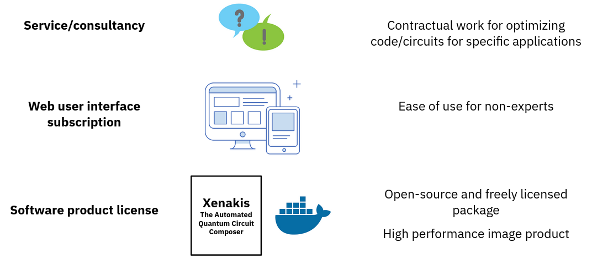
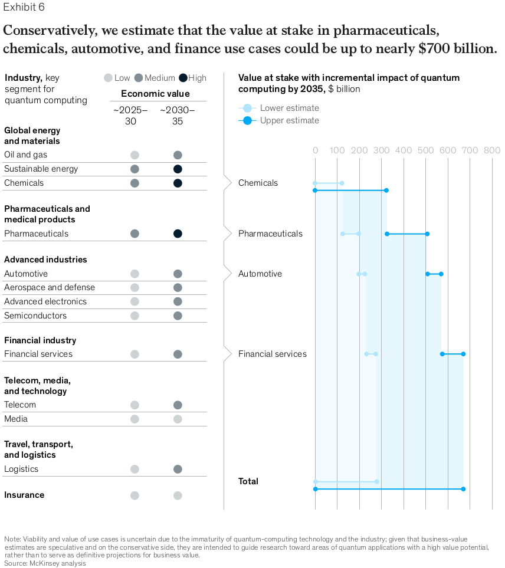

 
Hand drawn picture by Mark Nicholas Jones. Lead pencil on white paper, scanned and inverted. 2013

# Xenakis - The Automated Quantum Circuit Composer

## General description

Quantum computing is seeing more and more traction within research and industry to be applied to real use-case problems. Although of their mathematically proven advantage for certain problems over classical computing, the adoption of quantum computing will only be successfull if engineers, researchers and non-expert will be able to use Quantum Processing Units (QPUs) for their needs. A parallel can be drawn between classical computing where most users do not know how the inner circuits of their classical machine work, be it their device as a phone, their laptop or desktop machine.
The same goes for quantum computers and how to solve problems with them: Quantum circuits need to be defined so that one can solve for example problems within chemistry, finance and scheduling/logistics.

The Xenakis package allows to take over the task of generating a suitable circuit to be applied to solve a given problem.

## Technical description

The technical description of the whole Xenakis package can be read up here: https://github.com/MQSdk/CDL_Hackathon_2022/blob/main/README.md

## Business model

When it comes to freely licensed and open-source software several approaches exist to build a business model on such kind of software tools/packages. In overall freely licensed tools can be integrated into a product stack or used for consultancy work where companies do not have the capacity (e.g. knowledge, time) to apply this tool efficiently.

The picture below depicts three different revenue streams which we at Molecular Quantum Solutions pursue with our portfolio of open-sourced tools and/or proprietary tools.

Further, Xenakis can be integrated with our quantum chemistry calculation pipeline which we will be releasing as individual parts in the near term future. Our customers can obtain the the modular container images or compiled packages how it best suits them with their own calculation pipeline. We can adapt our tools to our customers computational infrastructure.

## Market size

It is difficult to evaluate the market size opportunity for such a tool which can be used within several industries for various applications. Therefore we refer to a general market size analysis by McKinsey in their "Quantum computing: An emerging ecosystem and industry use cases" report:

[PDF report by McKinsey; "Quantum computing: An emerging ecosystem and industry use cases"](https://www.google.com/url?sa=i&rct=j&q=&esrc=s&source=web&cd=&cad=rja&uact=8&ved=0CAQQw7AJahcKEwiozO3Z9pj5AhUAAAAAHQAAAAAQAg&url=https%3A%2F%2Fwww.mckinsey.com%2F~%2Fmedia%2Fmckinsey%2Fbusiness%2520functions%2Fmckinsey%2520digital%2Four%2520insights%2Fquantum%2520computing%2520use%2520cases%2520are%2520getting%2520real%2520what%2520you%2520need%2520to%2520know%2Fquantum-computing-an-emerging-ecosystem.pdf&psig=AOvVaw3ZJvgONyYVlN-AkF2W6dPL&ust=1659006429478374)

[Blog article by McKinsey based on the report](https://www.mckinsey.com/business-functions/mckinsey-digital/our-insights/quantum-computing-use-cases-are-getting-real-what-you-need-to-know)

With respect to the Xenakis package which will have an impact on the domains chemistry, finance and scheduling/logistics.

We refer to the following numbers in the McKinsey report:

Pharmaceuticals: Quantum computers could help to increase revenue and even a "1 to 5 percent revenue increase would result in 15 billion USD to 75 billion USD of additional revenues and 2 billion USD to 12 billion USD in EBIT.

Chemistry: "In the context of the chemicals industry, which spends $800 billion on production every year (half of which relies on catalysis), a realistic 5 to 10 percent efficiency gain would mean a gain of 20 billion USD to 40 billion USD in value". Here we would like to state that quantum chemistry simulations which could benefit from quantum computing will not only be applied to catalytic reaction analysis but also to evaluate new formulations (product design) more efficiently or impact the optimization of manufacturing processes within the chemicals industry with respect to scheduling, flowsheet optimization and automation.

Finance: "... but as of 2021, the global lending market stands at 6.9 trillion USD, which suggests significant potential impact from quantum optimization."

Automotive (Logistics/Scheduling): "Even an industry-standard 2 percent productivity gain—in the context of an industry that spends $500 billion per year on manufacturing costs—would create 10 billion USD to 25 billion USD of value per year."

The below image depicts a visual break up of the different use-cases within the various domains.

From these numbers it can be seen that a market exist, the more important question will be in the future where the first large scale impact of quantum computing will enter and how societal will actually be transformed by this technological break through.

## Competitors

When it comes to quantum circuit synthesis and optimization of circuits we have not seen too many companies focusing on a general software tool for this kind of task. But we expect that several quantum computing software providers have some in-house tools or trade-secret algorithms implemented in their technology stack.

From our own experience and market knowledge we know that Classiq (https://www.classiq.io/) markets itself as a general quantum computing software framework with a "virtual quantum circuit printer" tool. We have found two patents by Classiq which sheds some light on how Classiq protects its' quantum circuit design tool:

Quantum circuit modeling:

https://patents.google.com/patent/US11288589B1/en?oq=+US11288589B1

Debugger for quantum computers:

https://patents.google.com/patent/US11294797B1/en?oq=+US11294797B1

Classiq makes use of a Constraint Satisfaction Problem (CSP) solver and states that the circuit can be formulated as a graph. We believe this a well thought out approach and see its benefits for quantum circuit design. For exploration purposes over the search space of quantum circuits we might see problems that the user still has to perform some overhead work to correctly specify their problem for the circuit designer offered by Classiq. Also the co-design between hardware and the software stack could lead to problems already defining constraints and a mathematical formulation which might already restrict the search space for appropriate circuit designs.

Since Xenakis is open-source and freely licensed under a MIT license, it would be an interesting endeveaour to combine Xenakis with the Classiq platform to see if there could be some synergistic effects.

Xenakis was validated with a widely used quantum-classical near-term quantum computing algorithm, namely the Variational Quantum Eigensolver (VQE) approach. We have not seen any study by Classiq which show cased that their platform with VQE. We might be wrong and this statement would be updated if we get referred to such a study.

## Presentation

The presentation slides can be found here: https://github.com/MQSdk/CDL_Hackathon_2022/blob/main/doc/CDL2022_Hackathon_Presentation.pdf

A video presentation link will follow after this project has been presented at the Creative Destruction Lab 2022 Hackathon pitch event.

## Name origin of Xenakis

https://en.wikipedia.org/wiki/Iannis_Xenakis

“Any musical piece is akin to a boulder with complex forms, with striations and engraved designs atop and within, which ... can decipher in a thousand different ways without ever finding the right answer or the best one ...” - Iannis Xenakis
