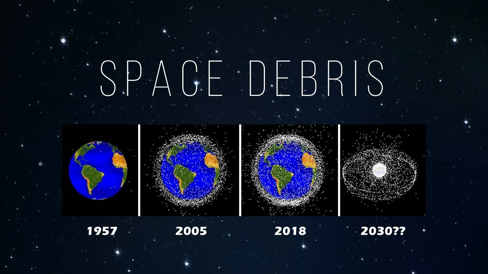

# Space Debris Removal Optimization

### What is Space Debris?
Space debris (also known as space junk, space pollution, space waste, space trash, or space garbage)  refers to objects that were created by humans but are no longer functional in space.
The debris includes rocket thrusters, abandoned satellites, and most importantly, fragments from collisions and explosions. It is estimated that 95% of all manmade satellites in low Earth orbit (LEO) are space junk.

### Problems Created by Space Debris
There were approximately 128 million pieces of debris under 1 cm (0.4 in), about 900,000 pieces between 1 and 10 cm, and approximately 34,000 pieces larger than 10 cm (3.9 in) in orbit around the Earth as of January 2019.

Space debris orbits around the earth at tremendous speeds - about 15,700 miles per hour (25,265 kph) in low Earth orbit which is 10 times the speed of a bullet. So there is a possibility that active satellites and spacecraft could be damaged by space debris. Space travel is also at risk due to all this debris. 

### Recent Events

### Space Debris Removal Optimization
* SpaceX starlink satellites

### Potential Customers
* Space agencies such as NASA, ESA, etc.
* Space companies such as SpaceX, OneWeb, etc.
* Space debris removal startups such as CleanSpace, Astroscale, etc.

### Business Value

### References:
* https://en.wikipedia.org/wiki/Space_debris
* https://www.youtube.com/watch?v=Ctvzf_p0qUA
